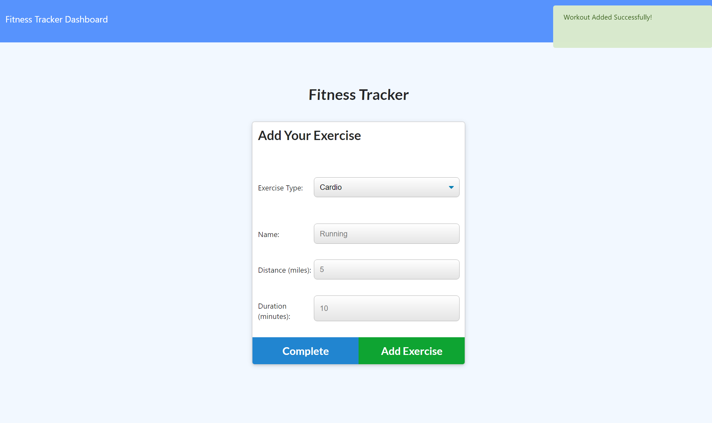

# WorkoutTracker
This application is designed to allow users to keep track of their workouts. Using this app, users such as yourself will be able to add a workout, customize the kind of workout you are attempting to do, include your weight, reps, and the duration of the workout. After adding your workout, you can also see the stats from your previous workouts. 


## Getting Started
Go into command line and run an npm install. Followed up with a npm run seed command that will lead to the app listening on a local host server which users can then enter into the browser and be lead into the working Workout Tracker application itself.


### Prerequisites

-Heroku

-Install Node

-Install VS Studio Code


### Installing

NPM install in integrated terminal

```

Then run the following command: npm run seed

```

Then run: npm run start

```

Open in your browser Localhost3000 and you will be directed to WorkoutTracker

```

## Screenshot of site




## Built With

* [HTML](https://developer.mozilla.org/en-US/docs/Web/HTML)
* [CSS](https://developer.mozilla.org/en-US/docs/Web/CSS)
* [Javascript](https://developer.mozilla.org/en-US/docs/Web/JavaScript)
* [Mongodb] (https://docs.mongodb.com/)

## Deployed Link

* [See Live Site](https://gsandoval09.github.io/WorkoutTracker/)


## Authors

* **George Sandoval** 

- [Link to Portfolio Site](https://gsandoval09.github.io/UpdatedProfessionalPortfolio/)
- [Link to Github](https://github.com/gsandoval09)
- [Link to LinkedIn](www.linkedin.com/in/george-sandoval-4467641b3)


## License

This project is licensed under the MIT License 

## Acknowledgments

* Google
* w3schools
* Mozilla


